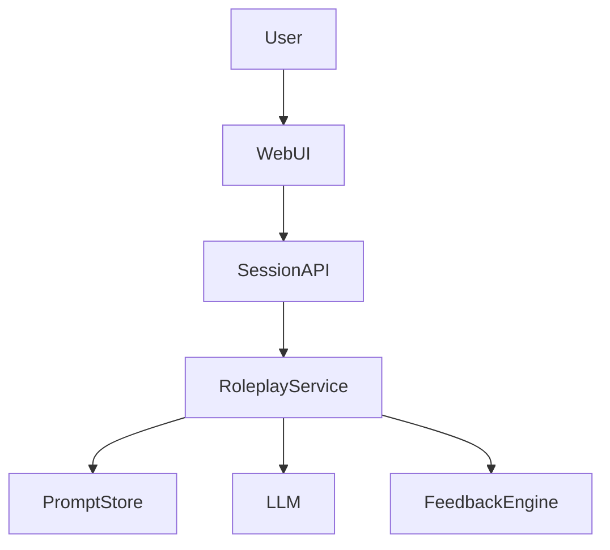

# 架构草图

## 1. 运行形态

- 运行形态：Web 应用 + 后端 API
- 主要入口：Web 前端发起练习，后端管理会话与模型交互
- 外部访问方式：HTTP API

## 2. 模块草图

## 3. 核心模块

| 模块 | 作用 | 输入/输出 | 备注 |
|------|------|-----------|------|
| WebUI | 用户选择角色与进行对话 | 输入用户消息，展示回复与反馈 | 首期做最小交互 |
| SessionAPI | 管理练习会话 | 会话创建、消息收发、结束练习 | HTTP API |
| RoleplayService | 编排角色和对话逻辑 | 用户输入 -> 角色回复 | MVP 核心 |
| FeedbackEngine | 生成反馈总结 | 会话记录 -> 反馈 | 首期做结构化文本 |

## 4. 关键对象 / 状态

| 对象 | 作用 | 关键字段/状态 | 备注 |
|------|------|----------------|------|
| RoleTemplate | 角色模板 | 名称、场景、提示词 | 先支持预置 |
| PracticeSession | 练习会话 | session_id、status、messages | 状态：active / closed |
| FeedbackSummary | 练习反馈 | summary、strengths、suggestions | 会话结束后生成 |

## 5. 技术方向

- 推荐技术栈：Web 前端 + Golang API + LLM Provider
- 备选技术栈：纯后端先行、CLI 原型
- 采用原因：用户交互体验是核心，Web MVP 更自然
- 放弃原因：CLI 更快，但不符合长期产品形态

## 6. 外部依赖与边界

| 依赖 | 作用 | 是否 MVP 必需 | 备注 |
|------|------|----------------|------|
| LLM Provider | 生成角色回复与反馈 | 是 | MVP 核心依赖 |
| 持久化存储 | 保存模板和会话 | 否 | 首期可先最小化 |

## 7. 待确认技术点

- 会话历史是否首期持久化
- 是否需要对模型成本做配额控制
