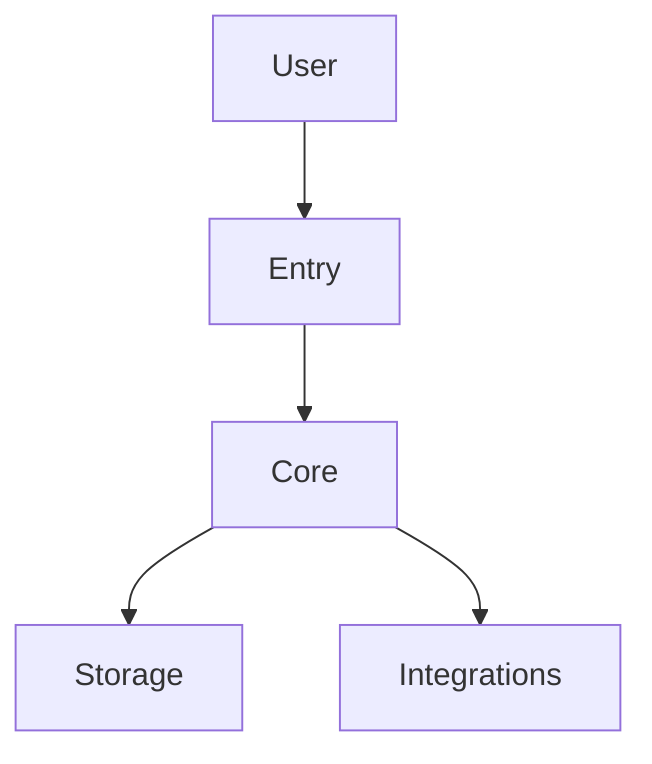

# 架构草图

> 用途：记录新项目当前阶段已收敛的技术方向、模块边界与关键对象。
> 要求：这是项目启动级草图，不是最终实现设计；证据不足时写“待确认”。

## 1. 运行形态

- 主语言 / language profile：
- 语言确认状态：pending / confirmed / inferred
- 运行形态：
- 主要入口：
- 外部访问方式：

## 2. 模块草图

## 3. 核心模块

| 模块 | 作用 | 输入/输出 | 备注 |
|------|------|-----------|------|
| | | | |

## 4. 关键对象 / 状态

| 对象 | 作用 | 关键字段/状态 | 备注 |
|------|------|----------------|------|
| | | | |

## 5. 技术方向

- 推荐技术栈：
- 备选技术栈：
- 采用原因：
- 放弃原因：

## 5.1 技术选型影响

只记录已经确认或明确待确认的选型对架构的影响，不把默认推荐写成事实。

| 选型组 | 当前状态 | 对模块边界的影响 | 对依赖 / 部署的影响 | 对验证的影响 |
|--------|----------|------------------|---------------------|--------------|
| | confirmed / pending / not_applicable | | | |

## 6. 外部依赖与边界

| 依赖 | 作用 | 是否 MVP 必需 | 备注 |
|------|------|----------------|------|
| | | 是 / 否 | |

## 7. 待确认技术点

- 
