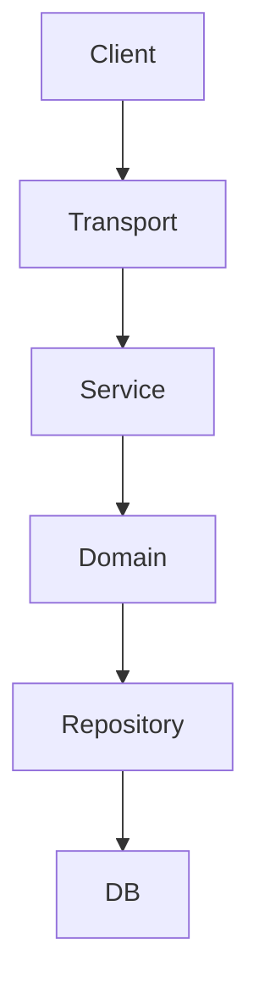
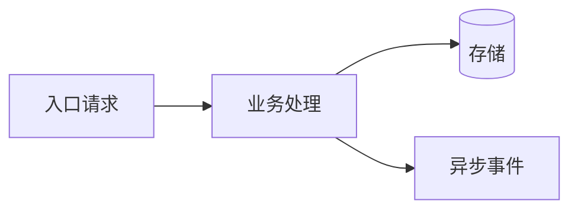

# 系统导览

> 用途：面向新维护者、接手者、评审者输出“如何理解这个项目”的认知材料。
> 要求：关键结论必须有目录结构、代码入口、调用链或配置证据支撑。
> 填写原则：
> - 项目明确具备的能力：写清结构、入口和工作方式
> - 项目明确不具备的能力：直接写“当前不具备”或“当前未发现该能力”
> - 证据不足：写“待确认”，不要为了补齐章节持续扩大读取范围

## 1. 系统定位

- 应用名：
- 核心目标：
- 业务边界：
- 核心能力清单：
- 非目标范围：
- 运行形态：
- 外部依赖版图：

## 2. 总体架构

### 2.1 架构摘要

用 3-6 句话讲清系统的核心结构，不讲问题，只讲“现在是怎么工作的”。

### 2.2 模块与分层图

### 2.3 核心子系统划分

| 子系统 | 作用 | 边界 | 证据 |
|--------|------|------|------|
| | | | |

### 2.4 关键目录与职责

| 目录/模块 | 职责 | 证据 |
|-----------|------|------|
| | | |

### 2.5 模块间依赖方向

- 主要依赖方向：
- 依赖反转或跨层调用例外：
- 典型调用路径摘要：

## 3. 核心调用链

### 3.1 主链路 1

- 场景：
- 入口：
- 关键步骤：
- 关键依赖：
- 输出/落点：
- 读/写路径：
- 外部交互边界：

### 3.2 主链路 2（可选）

- 场景：
- 入口：
- 关键步骤：
- 关键依赖：
- 输出/落点：
- 读/写路径：
- 外部交互边界：

## 4. 核心数据流 / 状态流

### 4.1 数据流向图

### 4.2 异步链路 / 消息流（若无则写“当前不具备”）

- 生产入口：
- 消费入口：
- 重试 / 死信 / 补偿：
- 与主链路关系：

### 4.3 外部系统交互边界

| 外部系统 | 交互方式 | 进入点/调用点 | 备注 |
|----------|----------|----------------|------|
| | | | |

### 4.4 核心对象与状态

| 对象/实体 | 作用 | 关键状态/关键字段 | 备注 |
|-----------|------|------------------|------|
| | | | |

## 5. 核心领域模型

### 5.1 核心实体

| 实体/聚合 | 作用 | 关键字段 | 证据 |
|-----------|------|----------|------|
| | | | |

### 5.2 状态机 / 状态流转

| 对象 | 状态 | 关键迁移 | 约束 |
|------|------|----------|------|
| | | | |

### 5.3 关键约束

- 业务约束：
- 幂等点：
- 权限前置点：
- 一致性关键点：

## 6. 关键技术机制

### 6.1 配置机制

- 读取入口：
- 来源：
- 默认值 / 必填策略：

### 6.2 日志与可观测性

- 日志入口：
- 关键字段：
- metrics / trace / alerting：

### 6.3 错误处理与传播

- 错误产生入口：
- 包装/透传方式：
- 对外暴露方式：

### 6.4 初始化 / 依赖注入链路

- 启动入口：
- 初始化顺序：
- 依赖注入方式：

### 6.5 并发模型（若无则写“当前未发现显式并发模型”）

- 主要并发场景：
- Goroutine / channel / lock / errgroup 使用方式：
- 并发风险关注点：

### 6.6 缓存策略（若无则写“当前不具备缓存层”）

- 缓存类型：
- 读写策略：
- 失效策略：

### 6.7 任务调度 / MQ 消费机制（若无则写“当前不具备”）

- 调度/消费入口：
- 触发方式：
- 失败处理：

### 6.8 测试与验证方式

- 测试主框架：
- 关键验证方式：
- 回归重点：

### 6.9 其他核心技术模块（按项目补充）

- 模块：
- 实现原理：
- 关键入口：

## 7. 项目难点与高风险点

| 类型 | 描述 | 为什么难/为什么高风险 | 证据 |
|------|------|----------------------|------|
| | | | |

建议优先覆盖：
- 历史包袱
- 复杂耦合点
- 隐式约束
- 高风险模块
- 容易误改的链路
- 回归成本高的区域

## 8. 推荐阅读路径

建议给出 5-10 个最值得先读的目录、文件或链路。

1. 
2. 
3. 

阅读建议：
- 先看事实：`project-context.md`
- 再看系统讲解：`system-overview.md`
- 再看问题体检：`cc-inspect-codebase` 产物
- 最后看真实 change：`.claude/docs/examples/changes/` 与进行中的 `.cairness/changes/<change-id>/`

## 9. 运维与验证视角

- 启动流程：
- 本地运行关键步骤：
- 配置切换点：
- 常见验证方法：
- 发布观察点：
- 常见故障定位入口：

## 10. 理解缺口与待确认事项

- 
- 

## 11. 演进与治理视角

- 当前最值得治理的结构问题：
- 哪些模块适合先拆：
- 哪些技术债影响后续迭代：
- 哪些 change 应该先做：
- 若要找问题：建议执行的 `cc-inspect-codebase` 模式和 scope
- 若要改需求：建议先看的模块 / 链路
